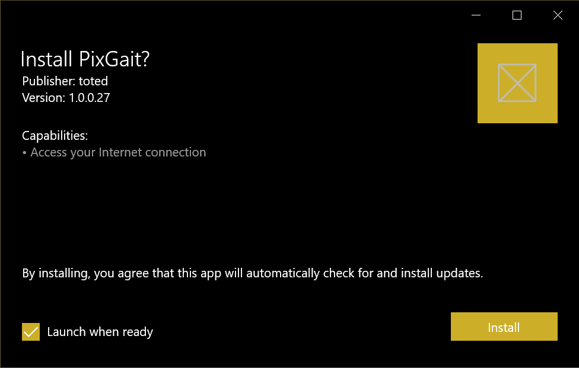
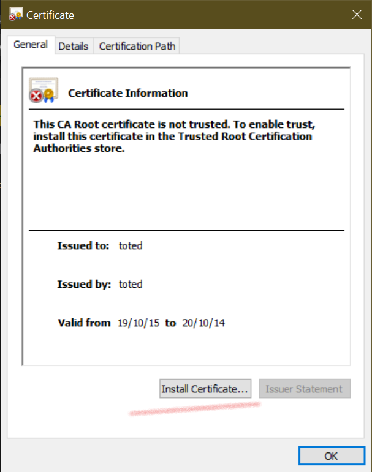
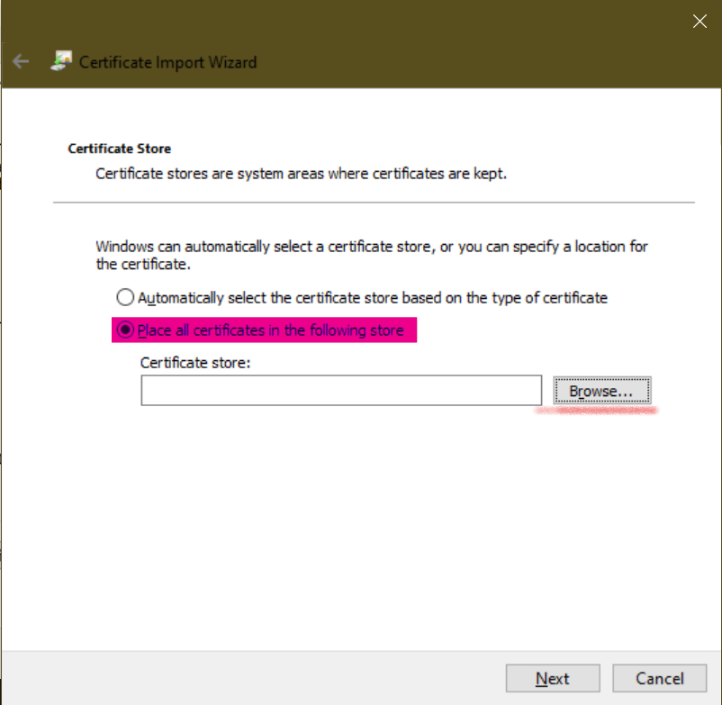
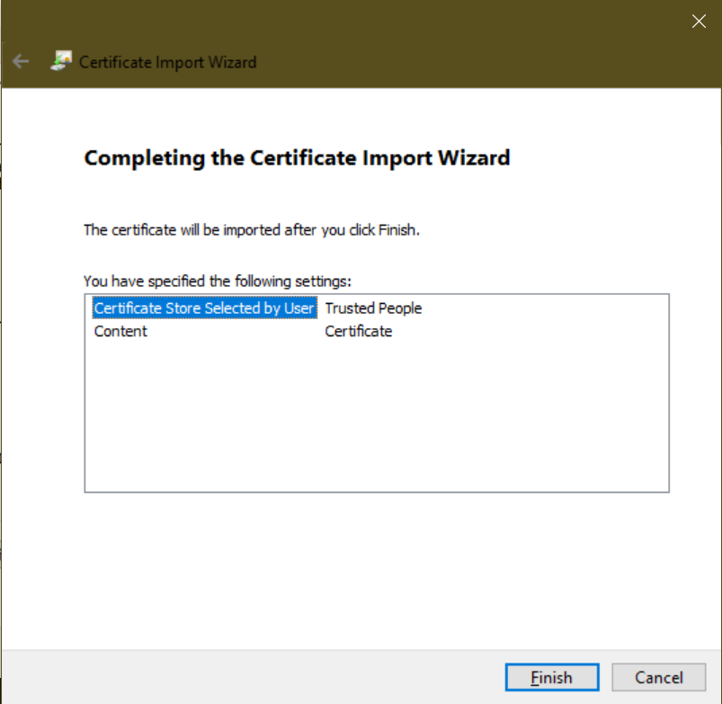
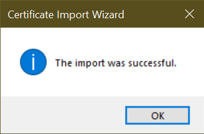

# APPNAME__TEMPLATE

Version: VERSION__TEMPLATE

- Install Certificate (instructions below)
- [Download app installer](APPNAME__TEMPLATE.appinstaller)
- Open app installer. Click install:

  
  
- If instalation completes with error:
  
   *Either you need a new certificate installed for this app package, or you need a new app package with trusted certificates. Your system administrator or the app developer can help. A certificate chain processed, but terminated in a root certificate which isn't trusted (0x800B0109)*
  
  Follow steps for installing certificate first:

## How to install certificate

- <a href="APPNAME__TEMPLATE_VERSION__TEMPLATE_Test/APPNAME__TEMPLATE_VERSION__TEMPLATE_x86.cer" download="APPNAME__TEMPLATE_VERSION__TEMPLATE_Test/APPNAME__TEMPLATE_VERSION__TEMPLATE_x86.cer">Download .cer file</a>
- Open certificate. You will be asked if you want to open this file. Click **Open**. 
- Click **Install Certificate**:
  
  

- Select **Local Machine** (not the default option!):
  
  

- Click **Next** and **Yes** in next prompt.
- On Certificate store screen, select **Place all certificates in the following store** option and click **Browse**
  
  

- Select **Trusted People** and click **OK**. Then clik **Next**
  
  

- Click **Finish**:
  
  

- Cerificate was successfully imported:
  
  

